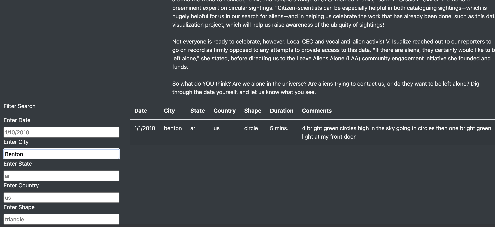

# UFOs

## Purpose of the Analysis
The purpose of the analysis was to add additional filtering for the table on the UFO's webpage.  The goal was to remove the event clicker and look for changes on the filter lines for state, shape, city, and country in addition to the existing date filter function.
### Results
The results are successful as the table is not filterable on changes in any of the input values of date, country, shape, state, and city.  A couple of the examples are below.
In figure 1, we can view the loaded table without filters applied.  Next the circle shape is input in to the shape filter and the table is updated to reflect UFO sightins where the shape is a circle.  The results are displayed in figure 2.  Next the circle is deleted but the city of Benton is added.  The results of the city filter are displayed in figure 3.
Figure 1 

Figure 2 

Figure 3 
### Summary

#### **Drawbacks of this webpage**

One of the drawbacks to this web page is the lack of a pulldown menu for the potential list of values.  For instance, if you are looking for a city or shape you have to try shapes and cities until you get the right spelling or shape type.  If you type in Denver for instance there are no returns, but there are other cities nearby that have had sightings.  If you had a pulldown that was dynamic it would help the user choose another close by option.  As it stands now you have to filter by state to get a list of potential cities.  For available shapes, a user needs to scroll through the list to see shape types.

#### **Two additional recommendations**

1. One potential enhancement would be to include a map with dots that show locations.  A user could then select the area and sightings from the map to filter the table.

2. As mentioned before, users could be aided by pulldown menus that are dynamic when another filter is selected.  For instance, if a user selected the the country (us), the cities, shapes, shapes and states should reduce to a pulldown of those values found in the (us).  Similarly, if a user selected a state, then only the cities, dates, and shapes should be available to further refine the filter.  This would allow for a more efficient filter system to rapidly identify UFO sightings.
